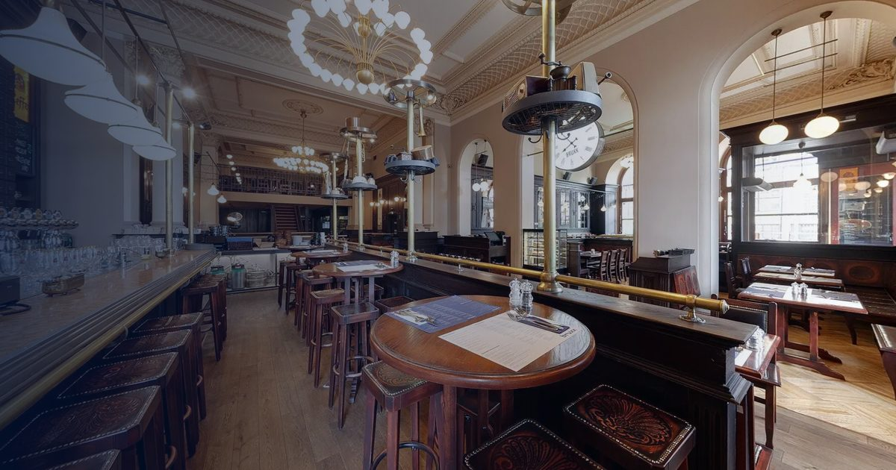

# Bruxx — Belgian brasserie in Prague

A redesign of [bruxx.cz](https://www.bruxx.cz/), the website of a Belgian brasserie on
Náměstí Míru in Prague: fresh mussels three times a week, fries double-fried in
beef tallow, more than sixty Belgian beers and Liège waffles.

**[Open the site](https://mrnednick.github.io/bruxx/)**



## What it does

- **Live menu.** The restaurant keeps its menu in Menubot. The site renders a
  snapshot instantly and then swaps in the live data: today's lunch menu, the
  full food, drinks and wine list, and the beer list — in Czech and English.
- **Menu tools.** Sticky category bar that follows the scroll, accent-insensitive
  search, and an allergen filter that hides dishes containing any of the
  fourteen EU allergens.
- **Beer finder.** The beer list filtered by style and strength and sorted by
  strength or price, next to the general manager's own recommendations.
- **Booking.** The restaurant's Bookio widget in a dialog, opened from every page
  and from the old `#rezervace` links.
- **Lunch menu by e-mail.** Subscribes through the same Menubot endpoint as the
  current site.
- **Three languages.** Czech, English and German, each page with its own URL
  (`/piva`, `/en/beer`, `/de/bier`).
- **Opening hours** with an "open now / opens at" status in Prague time.
- **Gallery** with filters, a keyboard and swipe lightbox, the restaurant's
  videos and its Street View tour.
- **Chef's recipes** with a servings stepper that rescales the ingredients.
- **Light and dark theme**, reduced-motion support, and layouts down to 360 px.

## Stack

Vue 3, Vue Router, Vite. Self-hosted variable fonts (Archivo, Hanken Grotesk,
Fraunces). No UI framework and no tracking; Google Maps and YouTube load only
when the visitor asks for them.

## How the live menu works

Menubot serves the menu as scripts that `document.write()` HTML and sends no
CORS headers, so it cannot be fetched. `src/lib/live-menu.js` runs each script
inside a blank iframe with `document.write` replaced, and
`src/lib/menubot.js` turns the captured HTML into data. The same parser runs in
Node (`npm run menu:sync`) to refresh the snapshot in `src/data/`; the deploy
workflow runs it every morning.

## Develop

```bash
npm install
npm run dev        # http://localhost:5173
npm test           # parser, content, hours, filters, recipes
npm run menu:sync  # refresh the menu snapshot from Menubot
npm run build      # → dist/, base path /bruxx/
```

`BASE_PATH=/ npm run build` builds for a site served from the domain root.

## Deploy

A push to `main` runs the tests, builds and publishes to GitHub Pages
(`.github/workflows/deploy.yml`). The workflow also runs daily to refresh the
menu snapshot.

## Content

Texts, photos and the privacy policy are those of bruxx.cz and belong to the
restaurant; the German translation is new. The page carries `noindex` while
bruxx.cz is the live site.
